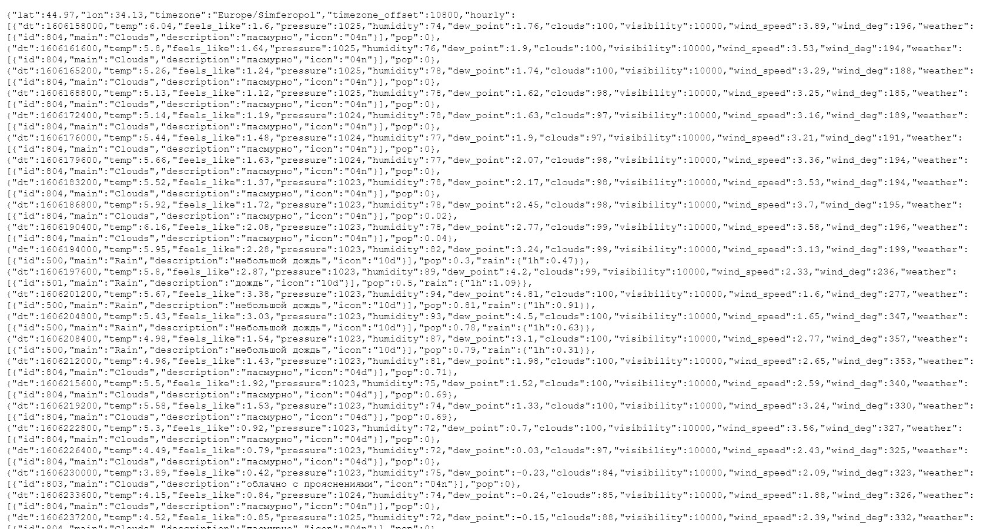
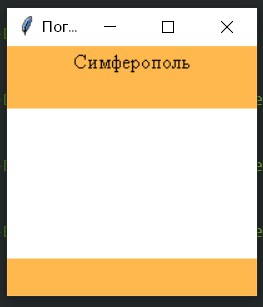
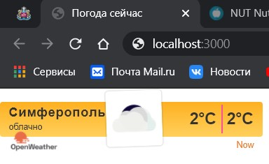

<p align="center">МИНИСТЕРСТВО НАУКИ  И ВЫСШЕГО ОБРАЗОВАНИЯ РОССИЙСКОЙ ФЕДЕРАЦИИ<br>

Федеральное государственное автономное образовательное учреждение высшего образования<br>

"КРЫМСКИЙ ФЕДЕРАЛЬНЫЙ УНИВЕРСИТЕТ им. В. И. ВЕРНАДСКОГО"<br>

ФИЗИКО-ТЕХНИЧЕСКИЙ ИНСТИТУТ<br>

Кафедра компьютерной инженерии и моделирования</p>

<br>

<h3 align="center">Отчёт по лабораторной работе № 1<br> по дисциплине "Программирование"</h3>

<br><br>

<p>студента 1 курса группы ПИ-б-о-202(1)<br>

Пислякова Олега Игоревича<br>

направления подготовки 09.03.04 "Программная инженерия"</p>

<br><br>

<table>

<tr><td>Научный руководитель<br> старший преподаватель кафедры<br> компьютерной инженерии и моделирования</td>

<td>(оценка)</td>

<td>Чабанов В.В.</td>

</tr>

</table>

<br><br>

<p align="center">Симферополь, 2020</p>

<hr>

## Постановка задачи
Разработать сервис предоставляющий данные о погоде в городе Симферополе на момент запроса.  В качестве источника данных о погоде используйте: http://openweathermap.org/. В состав сервиса входит: серверное приложение на языке С++ и клиентское приложение на языке Python.

Серверное приложение (далее Сервер) предназначенное для обслуживания клиентских приложений и минимизации количества запросов к сервису openweathermap.org. Сервер должен обеспечивать возможность получения данных в формате JSON и виде html виджета (для вставки виджета на страницу будет использоваться iframe).

Клиентское приложение должно иметь графический интерфейс отображающий сведения о погоде и возможность обновления данных по требованию пользователя.

Подробности указаны далее.

## Выполнение работы

### Задание 1

Захожу на сайт http://openweathermap.org/ и регистрируюсь. Посел, перейдя в свой аккаунт и я сгенерировал API key. Полученный ключ представлен ниже.

922ae5c7ebbebc281380526c9977222c

Далее я подставил свой ключ в ссылку, взятую из документации сайта http://openweathermap.org/, которая теперь имеет следующий вид.

http://api.openweathermap.org/data/2.5/onecall?lat=44.9698623&lon=34.1329217&exclude=current,minutely,daily,alerts&units=metric&lang=ru&appid=922ae5c7ebbebc281380526c9977222c

Перейдя по созданной ссылке я получил результат в виде JSON кода.



<center> <i> Рисунок 1.1. Полученный запрос с сайта. </center>

### Задание 2

Чтобы получить текущее время в формате json необходимо отправить запрос на сайт worldtimeapi.org. 
Запрос для получение Симферопольского время будет выглядеть так : http://worldtimeapi.org/api/timezone/Europe/Simferopol.

### Полный исходный код серверного приложения:

```c++
#include <iostream>
#include <iomanip>
#include <fstream>
#include <string>
#include <ctime>
#include <cpp-httplib/httplib.h>
#include <nlohman/json.hpp>
using json = nlohmann::json;
using namespace httplib;
json get_json();
json get_cache();
json get_hourly_request(json &hourly);
bool cachejson(json cacheView);
json get_time();
void findandreplace(std::string & data, std::string toSearch, std::string replaceStr){
    size_t pos = data.find(toSearch);
    while(pos != std::string::npos){
        data.replace(pos, toSearch.size(), replaceStr);
        pos = data.find(toSearch, pos + replaceStr.size());
    }
}
void responce(const Request &req, Response &res){
    json body;
    json forecast;
    body = get_cache();
    if (body.empty()){
        body = get_json();
        if (!body["Error"].is_null()){
            res.set_content(body["Error"], "text/plain");
            return;
        }else if (!body["Error"].is_null()) {
            res.set_content(body, "text/json");
        }
        cachejson(body);
        forecast = get_hourly_request(body["hourly"]);
        if (!forecast["Error"].is_null()){
            res.set_content(forecast["Error"], "text/plain");
            return;
        }
    }
    std::string tamplname = "templ.html";
    std::ifstream tamplate(tamplname);
    std::string str;
    if (tamplate.is_open()){
        getline(tamplate,str, '\0');
        tamplate.close();
    }
    else {
        res.set_content("Error", "text/plain");
        return;
    }
    findandreplace(str, "{hourly[i].weather[0].description}", forecast["weather"][0]["description"]);
    findandreplace(str, "{hourly[i].weather[0].icon}", forecast["weather"][0]["icon"]);
    findandreplace(str, "{hourly[i].temp}", std::to_string(int(round(forecast["temp"].get<double>()))));
    res.set_content(str, "text/html");
}
void responceraw(const Request &req, Response &res){
    json bodyRow;
    json forecastRow;
    bodyRow = get_cache();
    if (bodyRow.empty()){
        bodyRow = get_json();
        if (!bodyRow["Error"].is_null()) {
            res.set_content(bodyRow, "text/json");
            return;
        }
    } else if (!bodyRow["Error"].is_null()) {
        res.set_content(bodyRow, "text/json");
    }
    
    forecastRow = get_hourly_request(bodyRow["hourly"]);
    if (!forecastRow["Error"].is_null()) {
            res.set_content(forecastRow["Error"], "text/plain");
            return;
        }
    cachejson(bodyRow);
    std::string tamplname = "templ.html";
    std::ifstream tamplate(tamplname);
    std::string str;
    if (tamplate.is_open()){
        getline(tamplate,str, '\0');
        tamplate.close();
    }
    else {
        res.set_content("Error", "text/plain");
        return;
    }
    json output;
    output["temp"] = forecastRow["temp"];
    output["description"] = forecastRow["weather"][0]["description"];
    res.set_content(output.dump(), "text/json");
    }
int main(){
    Server myserv;
    myserv.Get("/", responce);
    myserv.Get("/raw", responceraw);
    myserv.listen("localhost", 3000);
}
```

### Полный исходный код клиентского приложения:

```python
from tkinter import *
import json
import requests

def reload_data(event=None):
    try:
        response = requests.get('http://localhost:3000/raw').content.decode("utf8")
        forecast_j = json.loads(response)

        desc.config(text=str(forecast_j["description"]))
        temp.config(text=str(forecast_j["temp"]) + "°C")
    except requests.exceptions.ConnectionError:
        pass

root = Tk()
root.title("Погода")
root.pack_propagate(0)
root.bind("<Button-1>", reload_data)

_yellow = "#ffb84d"
_white = "#ffffff"
_w = 100        
_h = 30

top_frame =    Frame(root, bg=_yellow, width=_w, height=_h)
middle_frame = Frame(root, bg=_white,  width=_w, height=_h*3)
bottom_frame = Frame(root, bg=_yellow, width=_w, height=_h)

top_frame.pack(side=TOP, fill=X)
middle_frame.pack(expand=True, fill=BOTH)
bottom_frame.pack(side=BOTTOM, fill=X)

city = Label(top_frame, font=("Times New Roman", 12), text="Симферополь", bg=_yellow)
desc = Label(top_frame, font=("Times New Roman", 12), bg=_yellow)
temp = Label(middle_frame, font=("Times New Roman", 48), bg=_white)

city.pack(pady=0)
desc.pack(pady=0)
temp.pack(expand=True)

reload_data()
root.mainloop()
```

Скриншот графического интерфейса:



<center> <i> Рисунок 1.2. Графический интерфейс. </center>

Скриншон браузера с загруженным виджетом:



<center> <i> Рисунок 1.3. Браузер с виджетом. </center>

## Вывод по работе. 

В ходе лабоарторной работы было выполнено следующее: я создал сервер на языке C++, который обращяется к openweathermap.com и возвращает температуру в формате json, а также я создал клиентское приложение на Python с графическим интерфейсом имеющее аналогичные функции созданного мною сервера, при этом я использовал новую для себя библиотеку Tkinter.