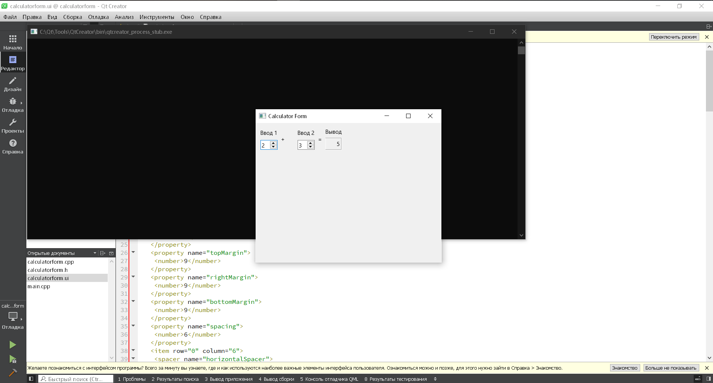

МИНИСТЕРСТВО НАУКИ  И ВЫСШЕГО ОБРАЗОВАНИЯ РОССИЙСКОЙ ФЕДЕРАЦИИ 
Федеральное государственное автономное образовательное учреждение высшего образования 
"КРЫМСКИЙ ФЕДЕРАЛЬНЫЙ УНИВЕРСИТЕТ им. В. И. ВЕРНАДСКОГО" 
ФИЗИКО-ТЕХНИЧЕСКИЙ ИНСТИТУТ 
Кафедра компьютерной инженерии и моделирования

 
<h3 align="center">Отчёт по лабораторной работе № 4  по дисциплине "Программирование"</h3>
  

студента 1 курса группы ПИ-б-о-202(1) 
Писляков Олег Игоревич 
направления подготовки 09.03.04 "Программная инженерия"

  
<table>
<tr><td>Научный руководитель  старший преподаватель кафедры  компьютерной инженерии и моделирования</td>
<td>(оценка)</td>
<td>Чабанов В.В.</td>
</tr>
</table>
  

Симферополь, 2020

## Постановка задачи

Настроить рабочее окружение, для разработки программного обеспечения при помощи Qt и IDE Qt Creator, а также изучить базовые возможности данного фреймворка.

## Выполнение работы

### Задание 1

Была проведена регистрация на оффициальном сайте Qt. Затем был скачан и установлен фреймворк Qt для open source пользователей под операционную систему Windows.

 
Рис. 1. Дизайнер Qt Creator 

### Задание 2

**Как изменить цветовую схему (оформление) среды?** 
`Tools > Options > Environment > Interface > Theme`

**Как закомментировать/раскомментировать блок кода средствами Qt Creator? Имеется ввиду комбинация клавиш или пункт меню.** 
`Edit > Advanced > Toggle Comment` или `Ctrl+/`

**Как открыть в проводнике Windows папку с проектом средствами Qt Creator?** 
В режиме редактирования нажимать ПКМ по папке и выбрать `Show containing folder`

**Какое расширение файла-проекта используется Qt Creator? Может быть несколько ответов.** 
`<название_проекта>.pro`

**Как запустить код без отладки?** 
Зелёный треугольник слева снизу или `Ctrl+R`

**Как запустить код в режиме отладки?** 
Зелёный треугольник с жучком слева снизу или `F5`

**Как установить/убрать точку останова (breakpoint)?** 
Нажать слева от номера строки

### Задание 3

 
Рис. 2. Отладка в Qt Creator 

**Чему равны переменные i и d в 6 строке?** 
`i = 32767` 
`d = 0.0`

**Чему равны переменные i и d в 7 строкe?** 
`i = 5` 
`d = 0.0`

**Чему равны переменные i и d в 8 строке?** 
`i = 5` 
`d = 5.0`

### Задание 4

На сайте <a href="https://www.toptal.com/developers/gitignore">gitignore.io</a> был сгенерирован .gitignore-файл с тегами Qt и Qt Creator, после чего содержимое файла было занесено в файл .gitignore в корне моего репозитория.

## Вывод

В ходе работы:

- был изучен фреймворк Qt Creator;
- была базово настроенна среда;
- был изучен проект калькулятора;
- было созданно консольное приложение для изучения процесса отладки.